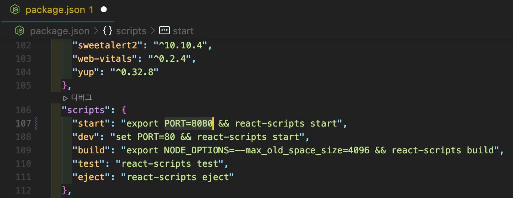

# Mac 80 포트 사용하기

Mac은 Windows와 다르게 기본 설정으로 80 포트를 사용하지 못한다.😭<br>
그래서 80포트를 사용하고 싶다면 사용하지 않는 다른 포트를 80포트에 포워딩해서 사용하는 편법을 사용해야 한다.<br>
= 포트포워딩(Port Fowarding)

### Step 1. anchor 파일 생성

터미널로 /etc/pf.anchors/ 경로에 com.pow라는 파일을 생성한다.
```bash
cd /etc/pf.anchors
```

```bash
sudo vi com.pow
```

아래의 내용을 입력하고 저장<br>

```bash
# 8080 포트를 80 포트로 포워딩하겠다는 뜻
rdr pass on lo0 inet proto tcp from any to any port 80 -> 127.0.0.1 port 8080
```

### Step 2. pf.conf 파일 수정

/etc/pf.conf 를 편집기로 연다.
```bash
vi /etc/pf.conf
```

rdr-anchor "com.apple/*": 이라는 줄 아래에 다음 내용을 추가한다.

```bash
rdr-anchor "pow"
```

load anchor "com.apple" from "/etc/pf.anchors/com.apple": 이라는 내용 밑에 아래 내용을 추가 하고 저장한다.

```bash
load anchor "pow" from "/etc/pf.anchors/com.pow"
```

### Step 4. pf.conf 적용

아래 명령어를 실행해 바꾼 내용을 적용해주자.

```bash
sudo pfctl -ef /etc/pf.conf
```
이제 프론트 앱을 실행할 때 8080으로 돌아가도록 한 뒤 80 포트로 접속하면 된다!🥳<br>


여기까지만 해줘도 8080 포트가 80으로 잘 적용이 되지만 재부팅을 하게 되면 적용 되었던게 초기화 되어 버린다.<br>
하지만 설정했던 파일은 남아있기 때문에 step 4부터 다시 적용해주면 되는데, 매 부팅 때마다 반복해주기 귀찮다면 부팅될 때 자동 적용 명령이 실행되도록 자동화를 만들어줄 수 있다.

### Step 5. 부팅시 자동적용

/System/Library/LaunchDaemons/에 접근하여 com.apple.pfctl.plist 파일에서 태그 안에 아래 내용을 추가해주면 된다.

```bash
<key>ProgramArguments</key>
<array>
    <string>pfctl</string>
    <string>-e</string>
    <string>-f</string>
    <string>/etc/pf.conf</string>
</array>
```