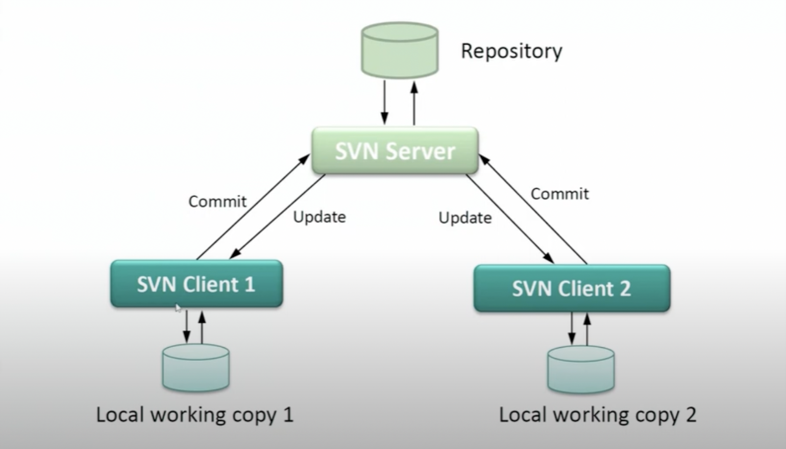
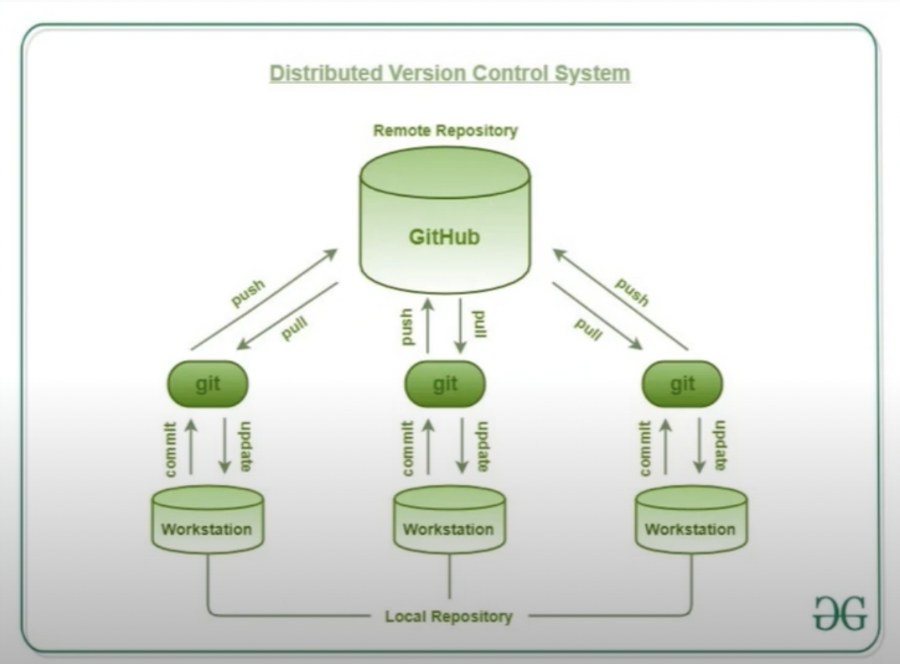

# 전세계 개발자가 모두 아는 그 고양이

> **깃허브다옹!!**

지금까지 이런 고양이는 없었다. 이것은 문어인가 고양이인가...
사실 이 고양이에 대해 이야기 하기보다는 이 고양이와 주고 받는 형상관리 정보, Git에 대해 정리해보려 한다.

# Github의 등장 이전
## SVN
SubVersion의 줄임말로 2000년대 초반에 등장해 git 등장 이전에 사용하던 형상관리 툴로 지금은 git에 밀려 사용하는 곳이 많이 없지만, 정부과제 si 업체나 엄청난 레거시 코드 같은 경우 아직 SVN을 사용하는 곳도 있다.

SVN도 90년대에 출시된 CVS라는 형상관리 툴의 한계를 극복하기 위해 나온 툴인데, 특징으로는 하나의 repository를 사용한다는 것이다.
### SVN의 장점
**굉장히 직관적이고 단순하다**

기록을 하는 Repository가 딱 하나!
origin이라는 마스터 저장소 딱 하나만 사용한다.
덕분에 사용법이 아주 간단하다.

1번 로컬에서 작업을 하다 커밋을 하면 바로 origin 서버로 날아간다.

### SVN 단점
**굉장히 단순하다**

origin 리포지토리 단 하나!
그 오리진은 로컬에 카피만 떠올 뿐, 내가 작업한 모든 것은 바로 서버에 올라간다

즉, 위 그림의 경우
2번 로컬에서 작업하던 사람이 업데이트를 받으면?
1번 로컬에서 작업하던 것까지 같이 업데이트 되버린다.

마찬가지로 2번 로컬에서 커밋을 하고, 1번 로컬에서 같은 부분에 커밋을 하면 서버에서 컨플릭트가 나겠지?
이렇게 되면 1번과 2번이 서로 회의하면서 오리진에 커플릭난 부분을 고쳐야 한다.

이러한 부분은 개발에 참여하는 개발자가 몇명 없거나, 개발하는 소스코드가 겹치는 부분이 없을 때에는 큰 문제가 되지 않지만...

그런건 없다ㅋㅋㅋㅋㅋ 절대!! 
요즘 개발할 때 그런 경우가 어디에 있겠나...

내가 작업한 코드를 누군가가 손대야하는 경우가 생기고, 수정을 하고나서 서로 커뮤니케이션이 안된 경우도 있을 것이다. 이 사이드 이펙트를 누군가는 엄청 크게 받을 수도 있는 것이다.

이러한 단순함으로 인해
- **사람들이 늘어날 수록 지켜야하는 컨벤션도 늘어남**
- **소스를 커밋하거나 업데이트 받을 때 불안함이 항상 존재**

위와 같은 엄청난 단점이 생기게 되기도하고,
시대가 지날수록 SVN을 사용하기 힘들어지는 또다른 이유는 개발자도 늘어나고, 사업도 늘어나고, 프로젝트의 규모도 커진다.

MSA, 클라우드 네이티브 아키텍처 등등 한 프로젝트에 repository가 엄청나게 늘어나고 한 repository에 붙게되는 사람도 늘어나고. 또 각 레포지토리끼리 서로 연관이 되어 있는데…

이것을 SVN만으로는 하려면 말 그대로 지옥이 펼쳐진다

이것을 개선하기 위해 Git이 나왔는데…

# Git의 등장
사실 Git이 나온지는 생각보다 오래됬다. 2005년 리눅스의 아버지, 리누스 토발즈가 출시를 했는데 처음에는 이전부터 계속 사용하던 SVN에 밀려 선택받지 못했다. SVN보다 복잡하고 난해한 사용법인 탓도 있었겠지?
하지만 2010년쯤 안드로이드가 대중화되면서 본격적으로 프로그래머들의 이목을 끌기 시작했고, 현재는 대표적인 형상관리 툴로 자리잡게 되었다. SVN의 단점을 보완하고 분산 기능과 확장성이 압도적이기 때문이지.

### 그렇다면 Git의 장점은 바로...

> 이제 이거 없으면 개발 안해!! 아니 못해!!

git도 리모트 레포지토리는 똑같이 존재한다. 하지만 내 로컬에도 똑같은 모양의 레포지토리를 만들어 둔다는게 SVN과의 차이점.

내 작업은 내 로컬 리포지토리에만 영향을 주지 원천 리모트 레포지토리에는 바로 영향을 주지 않는다.

다시말해 내가 작업한 것에 의해서 지속적인 영향을 받지 않는다.
잘못해서 업데이트를 받았다고 해서 SVN처럼 직관적으로 들어와가지고 내 코드에 영향을 주거나 문제를 발생시킬 여지가 확연히 줄어든다. (아예 없지는 않다. git을 사용할 때에도 주의 하지않으면 conflict는 나니까!)

왜? 나는 로컬에 나만의 공간을 가지고 있으니까! 😎

리모트 리포지토리에 문제가 발생했을 경우에도 SVN은 바로 복구할 수 있는 방안이 마땅치 않지만(로컬에 떠놓은 카피가 최신버전인지 알 방도가 없기 때문)

Git은 이미 리모트 리포지토리를 똑같이 복제해서 내 로컬에 가지고 있기 때문에(모든 브렌치의 정보도 포함해서) 바로 복구할 수 있는 것.

### Git에서 자주 쓰이는 용어
**Baseline**
- 계속 변경되는 문서 또는 소스파일의 승인된 리비전
- 변경되는 문서 또는 소스파일이 시작되는 지점

**Revision**
- 버전 관리의 특정 지점을 가리킴

**Branch**
- 특정 지점에서 Baseline으로 부터 분기된 독립적인 작업
- 분기 이후에는 각 Branch에서 독립적으로 개발할 수 있음

**Check-out**
- 특정 Local 작업본을 생성한다. 특정 리비전을 명시할 수 있음

**Commit**
- 작업본에 변경이 있거나 저장소 병합시 발생하는 이력을 남기는 작업

**Comflict**
- 동일한 문서에 서로 다른 변경사항이 있는 경우 발생하는 사항

**Merge**
- 특정 시점에 Baseline으로 부터 분기된 독립적인 작업
- 분기 시점 이후에는 각 Branch에서 독립적으로 개발할 수 있음

**Push**
- 현재 Local Git Repository에 작업 완료된 커밋이력을 원격저장소에 보내는 명령어

**Pull**
- Remote Git Repository → Local Git Repository로 소스코드를 가져오는 명령어
- 소스를 가져오고 Local code와 비교해서 Merge

**Fetch**
- Remote Git Repository → Local Git Repository로 소스를 가져오는 명령어
- 소스를 가져올 뿐 Merge는 하지않음
- Diff로 비교 후 필요한 것만 Merge 가능

## Github는?

git 원격 저장소는 Bitbucket,  GitLab 등 여러가지가 있지만 그 중 Github는 대표적인 무료 Git Repository 원격 저장소.
아주 깔끔한 Gui를 제공하고 있고 2018년에 MS에 인수되었다.

## 여기까지만 알고 바로 Git을 쓰면 될까?

> No!! 🙅

깃의 명령어들을 단순히 알고 있는 정도의 상태로는 그외 어떠한 것도 정해지지 않았기 때문에 어떻게 전략을 짜야할지 알 수 없다.
같이 협업을 하려면 기준이 필요하겠지?
이 전략 중 가장 대표적인 전략은 다음 글에 소개해보려 한다.

Coming Soooooooon!