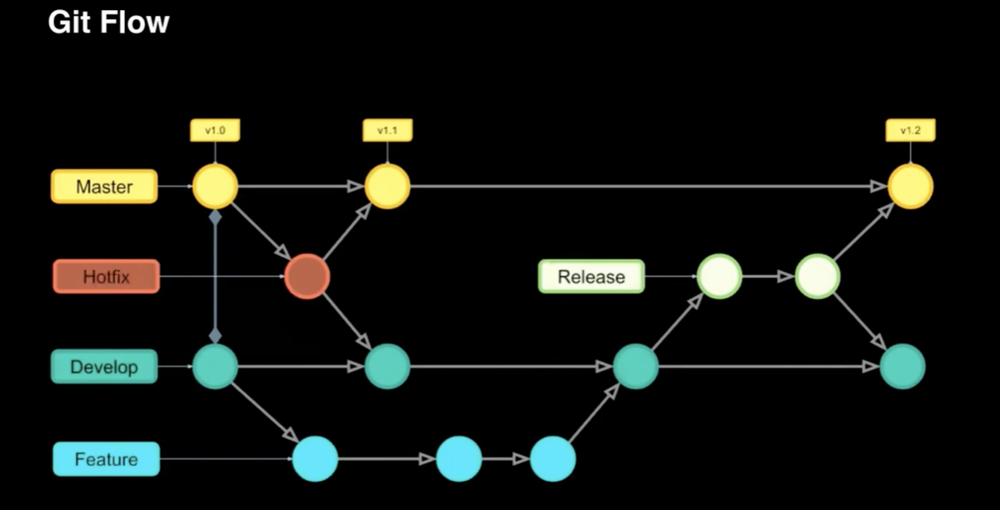

# Branch 전략

Branch 전략은 면접때 물어보는 경우도 굉장히 많다고 한다. 
Git과 협업에 대해 얼마나 공부하고 적용해봤는지, 또 얼마나 체계적으로 프로젝트를 개발했는지 알아보기 위해서겠지?

## Git Flow
대표적인 Branch 전략 ‘Git Flow’

  ### Master(Main)
  - Production에 출시가 가능한 브랜치
  - Master(Main) Branch에서 tag를 만들고 Production에 배포

  ### Develop
  - 개발이 완료된 최신 브랜치
  - 신규 개발된 내역이 처음 합쳐지는 브랜치

  ### Feature
  - 각 기능을 개발하는 브랜치
  - 기능 개발 단위로 Feature 브랜치가 생성됨

  ### Release
  - Develop 브랜치에서 생성됨
  - 개발이 완료되어 출시를 위해 준비하는 브랜치

  ### Hotfix
  - Production에 배포 된 버전에서 발생한 버그를 수정하는 브랜치
  - 핫픽스 된 부분은 개발 과정에서도 반영이 되야 하므로 Develop 브랜치에도 같이 merge하는 것

Main 또는 Master 버전 1.0에서 시작하고 이 디폴트 브랜치가 운영용 출시 브랜치이다.  
이 1.0 버전을 Baseline으로 하는 Develop 브랜치를 생성한다. 이 Develop 브랜치를 Baseline으로 하는 Feature 브랜치를 파서 각 기능 개발을 한다. 
위 그림에선 Feature 브랜치에서 개발 하면서 3번 커밋하고 개발이 완료됬다고 판단하고, Develop 브랜치로 merge 한 상태. 
Develop 브랜치로 merge하면서 Release 브랜치를 생성하고, Release 브랜치에서 출시 전 최종 테스트를 하게된다. Release에서 수정 작업이 필요했는지 1번의 커밋이 이루어졌다. 
Release 브랜치에 수정이 완료됬다고 판단된 후, Master 브랜치와 Develop 브랜치 양쪽으로 merge. 개발과 테스트 완료된 소스코드를 출시와 동시에 Develop에도 올려 다음 기능 개발의 준비를 한다. Main 브랜치는 버전을 하나 올림 
핫픽스는 Main 브랜치에 즉시 수정해야 할 버그가 발생했을 때 바로 고쳐서 적용하기 위해 Main 브랜치에서 바로 따와서 작업을 한 후 다시 Main 브랜치로 merge 해주면 된다. 이때 변경된 배포용 소스코드는 Develop 브랜치에도 같이 merge해서 기능 개발하는 Feature 브랜치에도 적용 될 수 있도록 해줘야 한다.

여기서 보면 Baseline이 되는 브랜치는 딱 2개다. 바로 Master 브랜치와 Develop 브랜치

Master에서 Baseline되는 경우는 핫픽스일 때만.

Develop에서 Baseline이 되는 경우는 하나는 Feature, 다른 하나는 Release

이게 바로 **Git Flow 전략**.

뭔가를 배포하거나 개발을 할때는 Develop이 Baseline이 되고

운영 중에 뭔가 급하게 고쳐야될 때 Master 브랜치에서 Hotfix 브랜치로
아주 명확한 전략 
브랜치 네이밍으로 컨벤션을 잡아놨기 때문에 네이밍만 보고 이 브랜치가 무엇을 위한 브랜치인지 알 수 있다.

하지만 이 전략에도 단점은 있는데, Develop에 모든 게 merge가 되기 때문에

Feature 브랜치로 기능 개발이 굉장히 오래가는 경우도 있는데 만약 3,4개월 이상 진행되면 그 Feature 브랜치는 그냥 유지되는 게 아니고 중간중간 계속 Develop에서 끌어와야 한다. 그렇게 되면 내가 건드렸던 소스코드가 변경될 여지가 있겠지? ⇒ Feature가 생각보다 긴 작업을 할 경우 Git Flow는 조금 힘든 부분이 있다. 그래서 이럴 땐 중간중간 계속 리뷰를 한다.

git push 하기 전에 꼭 git pull을 먼저 해서 최신화된 코드가 있는지 확인 먼저 하고 push를 하는게 좋다.